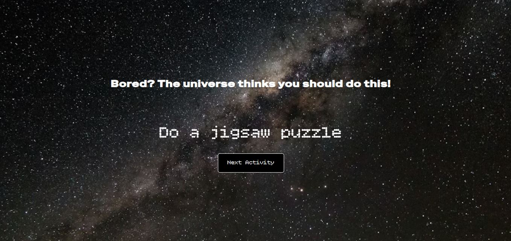

# Get an Idea

## Demo  
🔗 View the app on Netlify (https://lily-find-recipe.netlify.app)

## Project Description

**Get an Idea** is a small educational React application that helps users find ideas on what to do when they feel bored.

The app is built using **React (Vite)**. By clicking a button, the user receives a random suggestion fetched from an external API.

The application uses the `useEffect` hook to retrieve data from the API.  
It consists of two components:
- A main component that contains the core logic and the button.
- A second component that displays the suggestion text with animations created using **GSAP**.

No installation is required.

## Here's what the app looks like:

## How to Use:
- Click the button to get a suggestion.
- A new idea will be displayed each time you click the button.

## Features:
- Fetching random ideas from an external API using `useEffect`.
- React component-based structure.
- Text animation using GSAP.
- Simple and user-friendly interface.

## Requirements:
- A modern web browser.
- JavaScript enabled.

